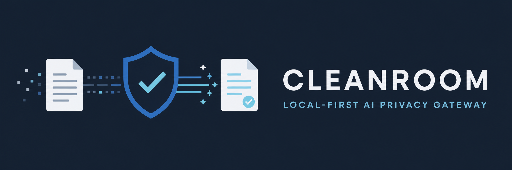
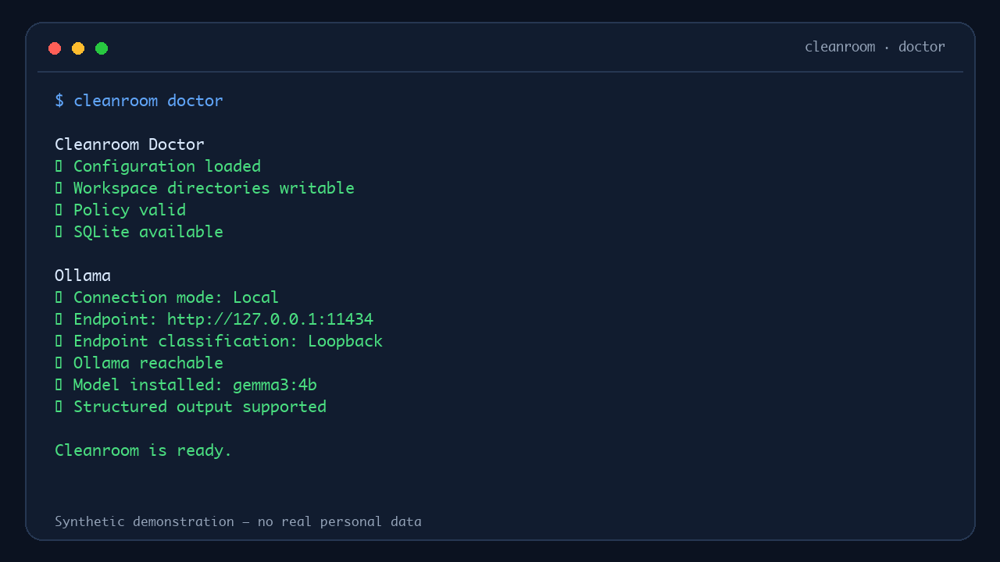
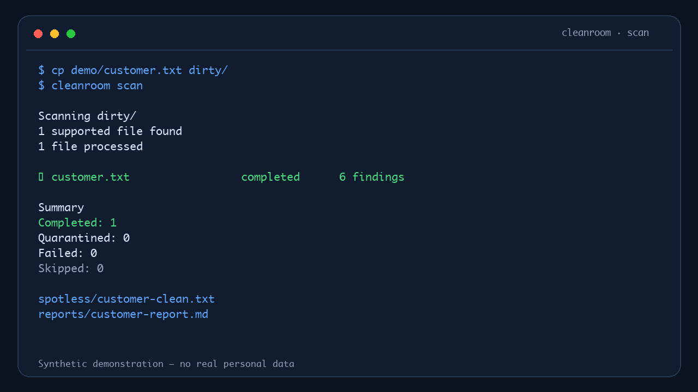
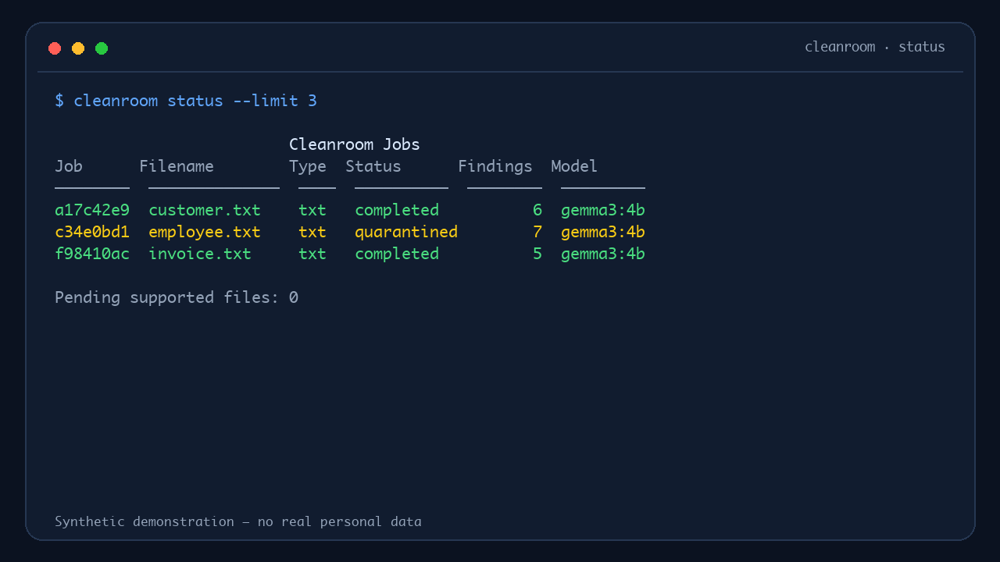
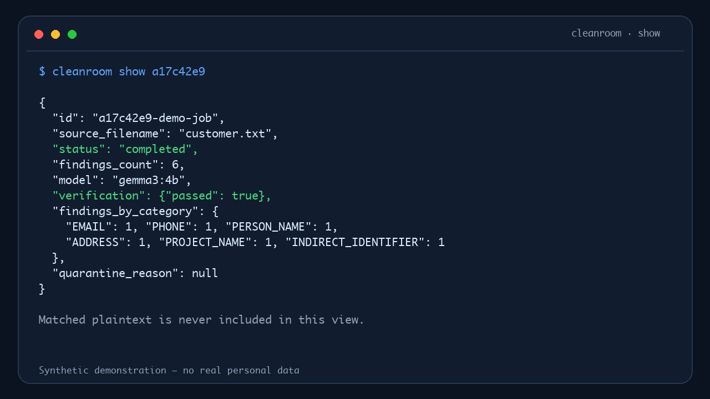
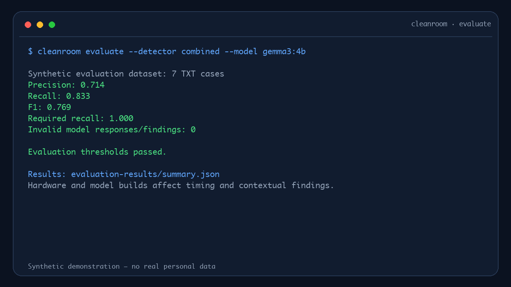

<p align="center">
  
</p>

<p align="center">
  <a href="https://github.com/leoscha/Cleanroom/releases/tag/v0.2.0"></a>
  <a href="https://github.com/leoscha/Cleanroom/actions/workflows/ci.yml"></a>
  
  <a href="LICENSE"></a>
</p>

**Cleanroom is a local-first AI Privacy Gateway that sanitizes sensitive information
before documents are shared with AI systems.**

It combines deterministic detection with a private Ollama model, replaces sensitive
values with stable placeholders, verifies the result, and fails closed when release
would be unsafe. Ordinary reports contain metadata and hashes—not matched plaintext.

<p align="center">
  
</p>

## Features

- Local Ollama by default; LAN, VPN, Tailscale, and secured custom endpoints are opt-in.
- Deterministic detection for emails, phones, SSNs, IPs, URLs, payment cards, API keys,
  bearer/JWT-like tokens, credentials, and private-key headers.
- Contextual private-model detection for people, addresses, projects, customers, dates,
  locations, organizations, and indirect identifiers.
- Overlapping chunks with global offsets, overlap-aware merging, and consistent aliases.
- Label-preserving replacements such as `password = [REDACTED_PASSWORD]`.
- Post-sanitization verification, placeholder validation, and fail-closed quarantine.
- Privacy-safe JSON/Markdown reports, SQLite history, duplicate prevention, atomic
  writes, workspace locking, interrupted-job recovery, and redacted logs.
- Versioned `default`, `strict`, and `ai-safe` policies.

## Quick Start

Requirements: Python 3.12+, [Ollama](https://ollama.com/), and Git.

```bash
git clone https://github.com/leoscha/Cleanroom.git
cd Cleanroom

python3.12 -m venv .venv
source .venv/bin/activate              # Windows: .venv\Scripts\Activate.ps1
python -m pip install -e .

ollama pull gemma3:4b
cleanroom init
cleanroom doctor
cleanroom demo --run
```

A new workspace automatically uses:

```env
OLLAMA_CONNECTION_MODE=local
OLLAMA_BASE_URL=http://127.0.0.1:11434
OLLAMA_MODEL=gemma3:4b
```

No network exposure or remote configuration is required. For another deployment,
run `cleanroom configure ollama` and read the [Ollama setup guide](docs/ollama-setup.md).

## Example workflow

Use the repository's entirely synthetic dataset:

```bash
cp demo/customer.txt dirty/
cleanroom scan
cleanroom status
cleanroom show JOB_ID
```

A successful TXT job creates:

```text
spotless/customer-clean.txt
processed/customer.txt
reports/customer-report.json
reports/customer-report.md
```

Useful commands:

```bash
cleanroom version
cleanroom watch
cleanroom process dirty/customer.txt
cleanroom verify spotless/customer-clean.txt
cleanroom retry
cleanroom config
cleanroom policies
cleanroom evaluate --detector combined
```

See runnable configuration and policy examples in [`examples/`](examples/).

## Screenshots

All shown values, job IDs, and outputs are synthetic.

<p align="center">
  
</p>

| Doctor | Scan |
| --- | --- |
| [](assets/screenshots/doctor.png) | [](assets/screenshots/scan.png) |
| Status | Show |
| [](assets/screenshots/status.png) | [](assets/screenshots/show.png) |
| Evaluation | |
| [](assets/screenshots/evaluate.png) | |

## Benchmarks

The v0.2.0 local `gemma3:4b` TXT baseline averaged **4.837 seconds/document** and
**0.207 documents/second** on an Apple M4 with 16 GB RAM. The seven-case synthetic
evaluation produced **0.714 precision**, **0.833 recall**, and **1.000 required-finding
recall**. See the full [methodology, caveats, and raw results](docs/benchmarks.md).

## Security philosophy

Cleanroom recommends local inference, sends documents only to the configured Ollama
endpoint, blocks public endpoints by default, validates every resolved IP, and never
opens firewall rules or configures Ollama to listen on `0.0.0.0`. Remote plain HTTP
requires explicit acknowledgement because Ollama has no built-in authentication by
default.

Verification is part of the release decision. Unsupported input, malformed model
output, sensitive content that remains, uncertain PDF mapping, or required review
causes a safe stop or quarantine.

Cleanroom reduces disclosure risk; it does **not** guarantee that every sensitive
item will be found. Read the [security model](SECURITY.md), [product
philosophy](docs/philosophy.md), and [privacy notes](PRIVACY.md) before production use.

## Supported formats

| Format | Status | Notes |
| --- | --- | --- |
| UTF-8 `.txt` | Supported | Primary v0.2 workflow |
| Text-based `.pdf` | Early support | Digitally generated PDFs with extractable text only |
| Scanned/image-only PDF | Rejected | OCR is not available |
| DOCX, images, spreadsheets | Rejected | Planned only after safe parsing and verification exist |

PDFs with encryption, forms, attachments, JavaScript, launch actions, uncertain text
mapping, or other unsupported structures fail closed. Passing verification is not a
claim of forensic irrecoverability against every PDF parser.

## Current limitations

- AI detection is probabilistic and model-dependent; human review may still be needed.
- OCR and image-only document analysis are not supported.
- Processing is sequential and designed for one local workspace.
- Cloud inference and public Ollama deployments are not normal supported defaults.
- There is no review UI or multi-user authorization model yet.
- Live results vary by model build and hardware; automated tests use mocked Ollama
  responses unless the optional live test is explicitly enabled.

## Roadmap

- **v0.2:** Production text sanitization.
- **v0.3:** Hardened native PDF support.
- **v0.4:** Local review UI.
- **v0.5:** OCR.
- **v1.0:** AI Privacy Gateway.

See [ROADMAP.md](ROADMAP.md) for scope and security expectations.

## Contributing

Issues and focused pull requests are welcome. Use synthetic data only and run:

```bash
pytest -q
ruff check .
mypy src
```

Read the [contribution guide](.github/CONTRIBUTING.md), [Code of
Conduct](.github/CODE_OF_CONDUCT.md), and [security reporting
policy](.github/SECURITY.md). Release information lives in the
[changelog](CHANGELOG.md) and [v0.2.0 notes](docs/releases/v0.2.0.md).

## License

Cleanroom is available under the [Apache License 2.0](LICENSE). See [NOTICE](NOTICE)
for attribution information.
